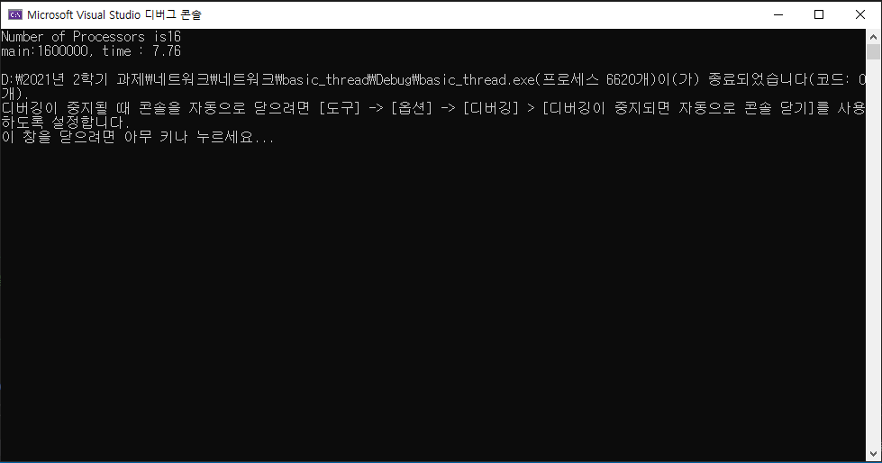

# Mutex 
+ 2021.10.07 네트워크 수업

## Mutex 코드
뮤텍스에서 counter 값이 증가하는 코드  
```C++
#include <WinSock2.h>
#include <process.h>
#include <iostream>

using std::cout;
using std::endl;

int counter;

HANDLE hmutex;

unsigned __stdcall func(LPVOID param) {
	int start = *((int*)param);
	int end = *((int*)param + 1);

	for (int i = start; i < end; i++) {
		//key 획득
		WaitForSingleObject(hmutex, INFINITE); // auto reset
		//이미 hmutex는 non-signal

		counter++;

		//key 반납
		ReleaseMutex(hmutex); //hmutex의 상태를 다시 signalled로 변환
	}

	return 0;
}

int main() {
	HANDLE th[16]; // CPU의 스레드 수를 저장하기 위한 배열 선언
	int arg[] = { 0, 100000 }; // 스레드 당 십만번의 연산을 위해 범위 지정

	// 뮤텍스 커널 오브젝트 생성
	hmutex = (HANDLE)CreateMutex(NULL, false, NULL);

	SYSTEM_INFO info;
	GetSystemInfo(&info); // 컴퓨터의 스레드 수를 저장

	cout << "Number of Processors is" << info.dwNumberOfProcessors << endl; // 화면에 컴퓨터의 스레드 수 출력

	clock_t stime = clock(); // 연산에 걸린 시간 계산하기 위해 시작 시간 저장

	for (DWORD i = 0; i < info.dwNumberOfProcessors; i++) // 스레드의 수만큼 반복문 실행
		th[i] = (HANDLE)_beginthreadex(NULL, 0, &func, arg, 0, NULL);

	WaitForMultipleObjects(info.dwNumberOfProcessors, th, true, INFINITE);

	clock_t etime = clock(); // 연산에 걸린 시간 계산하기 위해 종료 시간 저장


	// 연산에 걸린 시간 = 종료시간 - 시작시간
	cout << "main:" << counter << ", time : " << (double)(etime - stime) / CLOCKS_PER_SEC << endl;

	return 0;
}
```

## 실행 결과
