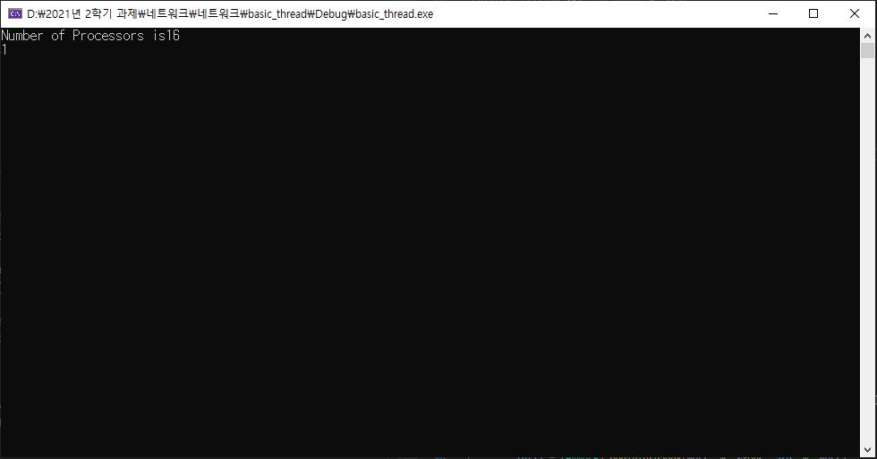

# CriticalSection 
+ 2021.10.07 네트워크 수업

## CriticalSection 코드
크리티컬 섹션으로 카운터가 1이면 중단하는 코드
```C++
#include <WinSock2.h>
#include <process.h>
#include <iostream>

using std::cout;
using std::endl;

int counter;

CRITICAL_SECTION cs; //임계영역 키 생성

unsigned __stdcall func(LPVOID param) {
	int start = *((int*)param);
	int end = *((int*)param + 1);

	for (int i = start; i < end; i++) {

		// 키 획득
		EnterCriticalSection(&cs);

		counter++;
		if (counter == 1) {
			cout << counter << endl;
			return 0;
		}

		// 키 반납
		LeaveCriticalSection(&cs);
	}

	return 0;
}

int main() {
	HANDLE th[16];
	int arg[] = { 0, 100000 };

	//생성된 키를 초기화
	InitializeCriticalSection(&cs);

	SYSTEM_INFO info;
	GetSystemInfo(&info);

	cout << "Number of Processors is" << info.dwNumberOfProcessors << endl;

	clock_t stime = clock();

	for (DWORD i = 0; i < info.dwNumberOfProcessors; i++)
		th[i] = (HANDLE)_beginthreadex(NULL, 0, &func, arg, 0, NULL);

	WaitForMultipleObjects(info.dwNumberOfProcessors, th, true, INFINITE);

	clock_t etime = clock();

	cout << "main:" << counter << ", time : " << (double)(etime-stime) / CLOCKS_PER_SEC << endl;

	return 0;
}

```

## 실행 결과


+ counter가 1일 때 키를 반납하지 않고 return하여 1이 출력된 이후 모든 스레드가 동작하지 않는다.